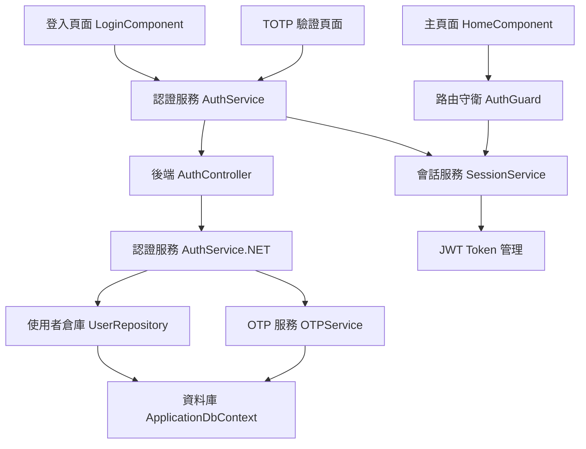

# Design Document

## Overview

登入頁面功能 (Login Authentication) 是 MOTP 雙因子驗證系統的核心認證入口，整合傳統的帳號密碼驗證與 TOTP 雙因子驗證。此設計遵循現有系統的架構模式，擴展既有的認證服務和前端元件，提供完整的多階段登入流程。

系統採用前後端分離架構，前端使用 Angular 18 + Angular Material + Bootstrap，後端使用 .NET 8 Web API + Entity Framework Core。設計重點在於安全性、使用者體驗和與現有 MOTP 系統的無縫整合。

## Steering Document Alignment

### Technical Standards (tech.md)
- **前端技術棧**: Angular 18 + TypeScript + Angular Material + Bootstrap，遵循現有專案標準
- **後端架構**: .NET 8 Web API 三層式架構 (Controller-Service-Repository)，與現有 OTP 系統保持一致
- **安全標準**: 實施 HTTPS、CORS、CSRF 保護、安全標頭，符合 NIST SP 800-63B 指南
- **編碼規範**: 使用 UTF-8 編碼，繁體中文介面，遵循專案既定的命名和註解規範

### Project Structure (structure.md)
- **前端結構**: 遵循 `features/auth/pages` 模式，與現有 `bind-device`、`otp-verify` 元件保持一致
- **後端分層**: 擴展現有的 `Controllers/`、`Services/`、`Repositories/`、`Models/` 結構
- **共享服務**: 整合既有的 `OtpService`、`EncryptionService`、`UserRepository`

## Code Reuse Analysis

### Existing Components to Leverage
- **OtpService (Angular)**: 擴展現有服務添加登入相關 API 方法
- **UserRepository (.NET)**: 利用現有使用者管理和帳號鎖定功能
- **EncryptionService (.NET)**: 重用密碼雜湊和加密功能
- **ApplicationDbContext**: 擴展現有資料庫上下文添加會話管理
- **Angular Material 元件**: 重用現有的表單、卡片、載入指示器元件

### Integration Points
- **現有 OTP API**: 整合 `/api/OTP/verify` 端點進行 TOTP 驗證
- **使用者管理系統**: 連接現有 `Users` 表和相關實體關係
- **前端路由系統**: 擴展現有 `app.routes.ts` 添加登入相關路由
- **備用驗證碼系統**: 整合現有 `BackupCodes` 表和相關服務

## Architecture

系統採用多階段認證架構，分為三個主要階段：帳號密碼驗證 → TOTP 驗證 → 會話建立。前端使用 Angular Signals 進行狀態管理，後端採用無狀態 API 設計，透過 JWT Token 管理使用者會話。

### Modular Design Principles
- **Single File Responsibility**: 登入元件專注於 UI 邏輯，認證服務專注於 API 互動，會話服務專注於狀態管理
- **Component Isolation**: 登入頁面、TOTP 驗證、會話管理各自獨立，可單獨測試和維護
- **Service Layer Separation**: 前端服務層 (AuthService) 封裝 HTTP 請求，後端服務層 (AuthService) 處理商業邏輯
- **Utility Modularity**: 密碼驗證、會話管理、錯誤處理等功能模組化



## Components and Interfaces

### Frontend Components

#### LoginComponent (Angular)
- **Purpose:** 處理帳號密碼登入 UI 和表單驗證
- **Interfaces:** 
  - `onLogin()`: 處理登入表單提交
  - `navigateToTOTP()`: 導向 TOTP 驗證頁面
- **Dependencies:** AuthService, Router, FormBuilder, MatSnackBar
- **Reuses:** 現有的 Angular Material 表單元件、載入狀態管理模式

#### TotpLoginComponent (Angular)
- **Purpose:** 處理 TOTP 驗證階段的 UI
- **Interfaces:** 
  - `verifyTOTP()`: 驗證 TOTP 驗證碼
  - `useBackupCode()`: 切換到備用驗證碼模式
- **Dependencies:** AuthService, OtpService, Router
- **Reuses:** 現有的 `OtpVerifyComponent` 設計模式和樣式

#### AuthService (Angular)
- **Purpose:** 封裝前端認證相關的 HTTP 請求和狀態管理
- **Interfaces:** 
  - `login(credentials)`: Observable<LoginResponse>
  - `verifyTOTP(userId, code)`: Observable<VerifyResponse>
  - `logout()`: void
  - `getCurrentUser()`: Observable<User>
- **Dependencies:** HttpClient, SessionService
- **Reuses:** 現有的 `OtpService` 錯誤處理和 HTTP 請求模式

#### SessionService (Angular)
- **Purpose:** 管理使用者會話狀態和 JWT Token
- **Interfaces:** 
  - `setSession(token, user)`: void
  - `clearSession()`: void
  - `isAuthenticated()`: boolean
  - `getToken()`: string | null
- **Dependencies:** 無 (獨立服務)
- **Reuses:** 瀏覽器 localStorage API

### Backend Components

#### AuthController (.NET)
- **Purpose:** 處理認證相關的 HTTP 請求
- **Interfaces:** 
  - `POST /api/auth/login`: 帳號密碼驗證
  - `POST /api/auth/verify-totp`: TOTP 驗證
  - `POST /api/auth/logout`: 登出
  - `GET /api/auth/profile`: 取得使用者資訊
- **Dependencies:** IAuthService, ILogger
- **Reuses:** 現有的 `OTPController` 結構和錯誤處理模式

#### AuthService (.NET)
- **Purpose:** 實現認證商業邏輯
- **Interfaces:** 
  - `AuthenticateAsync(email, password)`: Task<AuthResult>
  - `VerifyTOTPAsync(userId, code)`: Task<bool>
  - `GenerateJWTAsync(user)`: Task<string>
  - `ValidateSessionAsync(token)`: Task<User>
- **Dependencies:** IUserRepository, IOTPService, IEncryptionService
- **Reuses:** 現有的 `OTPService` TOTP 驗證邏輯

#### SessionManager (.NET)
- **Purpose:** 管理使用者會話和 JWT Token
- **Interfaces:** 
  - `CreateSessionAsync(user)`: Task<string>
  - `ValidateTokenAsync(token)`: Task<User>
  - `RevokeSessionAsync(token)`: Task
- **Dependencies:** IConfiguration (JWT 設定)
- **Reuses:** 現有的 JWT 相關配置

## Data Models

### LoginRequest (前端/後端共用)
```typescript
interface LoginRequest {
  email: string;           // 使用者電子郵件
  password: string;        // 使用者密碼
  rememberMe?: boolean;    // 記住登入狀態 (可選)
}
```

### LoginResponse (前端/後端共用)
```typescript
interface LoginResponse {
  success: boolean;        // 登入是否成功
  requiresTOTP: boolean;   // 是否需要 TOTP 驗證
  userId?: string;         // 使用者 ID (需要 TOTP 時)
  token?: string;          // JWT Token (完整認證後)
  user?: UserInfo;         // 使用者基本資訊
  errorMessage?: string;   // 錯誤訊息
}
```

### TOTPVerifyRequest (前端/後端共用)
```typescript
interface TOTPVerifyRequest {
  userId: string;          // 使用者 ID
  code: string;            // TOTP 驗證碼或備用驗證碼
  isBackupCode?: boolean;  // 是否為備用驗證碼
}
```

### SessionInfo (.NET)
```csharp
public class SessionInfo
{
    public Guid UserId { get; set; }           // 使用者 ID
    public string Email { get; set; }          // 使用者信箱
    public DateTime LoginAt { get; set; }      // 登入時間
    public DateTime ExpiresAt { get; set; }    // 過期時間
    public string IpAddress { get; set; }      // 登入 IP
    public string UserAgent { get; set; }      // 使用者代理
}
```

### AuthResult (.NET)
```csharp
public class AuthResult
{
    public bool IsSuccess { get; set; }        // 認證是否成功
    public User User { get; set; }             // 使用者物件
    public string ErrorMessage { get; set; }   // 錯誤訊息
    public int RemainingAttempts { get; set; } // 剩餘嘗試次數
    public DateTime? LockedUntil { get; set; } // 帳號鎖定到期時間
}
```

## Error Handling

### Error Scenarios

1. **帳號密碼錯誤**
   - **Handling:** 記錄失敗嘗試，超過限制後鎖定帳號
   - **User Impact:** 顯示錯誤訊息和剩餘嘗試次數

2. **帳號已鎖定**
   - **Handling:** 檢查鎖定狀態和到期時間
   - **User Impact:** 顯示帳號鎖定訊息和解鎖時間

3. **TOTP 驗證失敗**
   - **Handling:** 允許重新輸入，記錄失敗次數
   - **User Impact:** 顯示驗證失敗訊息，提供備用驗證碼選項

4. **會話過期**
   - **Handling:** 清除前端會話狀態，重導向登入頁面
   - **User Impact:** 顯示會話過期提醒，要求重新登入

5. **網路連線問題**
   - **Handling:** 實施重試機制，顯示連線狀態
   - **User Impact:** 顯示連線問題提醒，提供重試選項

6. **伺服器內部錯誤**
   - **Handling:** 記錄詳細錯誤日誌，回傳通用錯誤訊息
   - **User Impact:** 顯示友善的錯誤訊息，避免洩露敏感資訊

## Testing Strategy

### Unit Testing

#### 前端測試
- **AuthService**: 測試 HTTP 請求、錯誤處理、狀態管理
- **SessionService**: 測試 Token 儲存、驗證、清除功能
- **LoginComponent**: 測試表單驗證、使用者互動、導航邏輯
- **TotpLoginComponent**: 測試 TOTP 驗證流程、備用驗證碼切換

#### 後端測試
- **AuthController**: 測試 API 端點、請求驗證、回應格式
- **AuthService**: 測試認證邏輯、密碼驗證、TOTP 整合
- **SessionManager**: 測試 JWT 產生、驗證、撤銷功能

### Integration Testing

#### 前後端整合
- **完整登入流程**: 測試從帳號密碼到 TOTP 驗證的完整流程
- **API 整合**: 測試前端服務與後端 API 的資料交換
- **錯誤處理整合**: 測試各種錯誤情況的端到端處理

#### 資料庫整合
- **使用者認證**: 測試資料庫查詢、密碼驗證、帳號鎖定
- **會話管理**: 測試會話資料的儲存和查詢
- **稽核記錄**: 測試登入事件的記錄和查詢

### End-to-End Testing

#### 使用者場景測試
- **成功登入流程**: 完整的帳號密碼 + TOTP 驗證流程
- **錯誤處理流程**: 各種錯誤情況的使用者體驗測試
- **安全性測試**: 帳號鎖定、會話管理、權限控制測試
- **跨瀏覽器測試**: 確保在不同瀏覽器中的相容性

#### 效能測試
- **並發登入**: 測試多使用者同時登入的系統效能
- **負載測試**: 測試高負載情況下的系統穩定性
- **回應時間**: 測試各階段認證的回應時間是否符合需求 