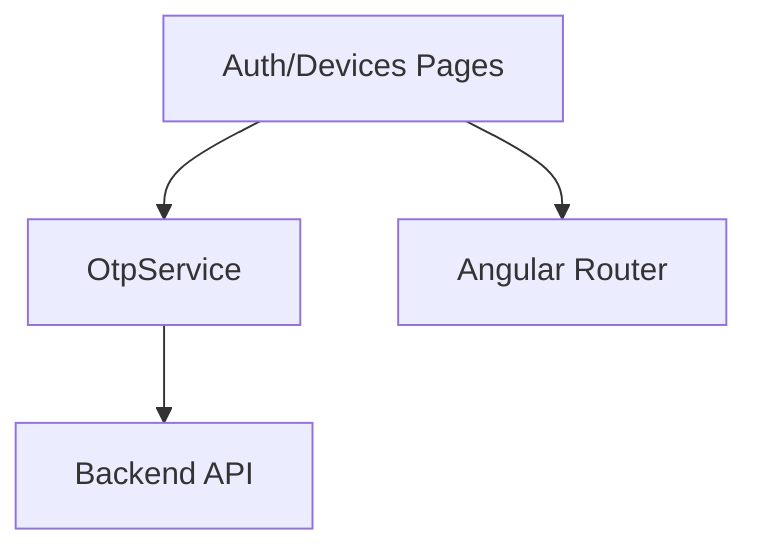

# Design Document

## Overview

MOTP（Mobile One-Time Password）網站以前端 Angular（Material + Tailwind）與後端驗證服務（C# .NET8 WEBAPI  ）實作；核心包含註冊/綁定、OTP 產生與驗證、裝置管理與備援、與 OIDC 整合。前端採 Standalone Components 與可存取性（WCAG 2.1 AA），後端提供 REST/GraphQL（可選）API，採用 TOTP（RFC 6238）。

## Steering Document Alignment

### Technical Standards (tech.md)
- Angular 20 + Standalone，使用 Angular Material 與 TailwindCSS。
- 型別嚴格（TypeScript），函式式與模組化風格。
- 安全：HTTPS、KMS/環境變數、CSRF/XSS/Clickjacking 防護、CSP。

### Project Structure (structure.md)
- 前端：`ngx-app/` 下以 feature 目錄劃分（如 `features/auth/`、`features/devices/`）。
- 後端：`BackEnd/` 採分層（Controller、Service、Repository）。

## Code Reuse Analysis

### Existing Components to Leverage
- Angular Material：Toolbar、Form Field、Button、Dialog、Table。
- TailwindCSS：版面與 RWD。

### Integration Points
- 身分系統（OIDC）：登入後攜帶 OTP 驗證結果（AMR/ACR）。
- OTP 服務：`POST /api/otp/verify`、`POST /api/devices/bind`、`GET /api/devices` 等。

## Architecture

- 前端 SPA + 後端 WEBAPI。
- OTP 以 TOTP（SHA-1，30s window，6 digits），伺服器維護密鑰與漂移視窗。
- 支援 Microsoft Authenticator、Google Authenticator：透過 `otpauth://` URI 與 QRCode 組態。
- 後端 WEBAPI 可 Mock Data 不用將資料存於DB中

### Modular Design Principles
- Single File Responsibility；Component/Service/Utility 各司其職。
- Service 層封裝 API 呼叫與錯誤處理。
- Utility 拆分：time drift、base32、otpauth URI 生成。

### WorkFlow
1. 使用者第一次需要在登入頁面中輸入[帳號/密碼] 產生QR Code。
2. 使用  Microsoft Authenticator 或 Google Authenticator 掃描 QR Code 完成註冊。
3. 之後每次登入[帳號/密碼]驗證通過後，再輸入 OTP 密碼，驗證通過後 才可進入首頁



## Components and Interfaces

### Component: `features/auth/pages/bind-device`
- **Purpose:** 輸入帳號、密碼後產生QR Code，手機App掃描QR Code完成裝置綁定。
- **Interfaces:** `(bind(accountId: string, password: string)) => Promise<void>`
- **Dependencies:** `OtpService`, `MatDialog`, `Router`
- **Reuses:** `qrcode` 第三方或自製 directive

### Component: `features/auth/pages/otp-verify`
- **Purpose:** 登入時輸入帳號、密碼、 OTP密碼並驗證。
- **Interfaces:** `(submit(accountId: string, password: string, code: string)) => Promise<void>`
- **Dependencies:** `OtpService`, `Router`

### Component: `features/devices/pages/manage-devices`
- **Purpose:** 列出已綁定裝置、解除綁定、產生備援碼。
- **Interfaces:** `(revoke(id))`, `(generateRecovery())`
- **Dependencies:** `OtpService`, `MatDialog`

## Data Models

### OtpBindRequest
```
- accountId: string
- password: string
- issuer: string
- secretBase32: string
- algorithm: 'SHA1'
- digits: 6
- periodSec: 30
```

### OtpVerifyRequest
```
- accountId: string
- code: string
- leewayWindows?: number
- clientTimeMs?: number
```

### Device
```
- id: string
- nickname: string
- createdAt: string
- lastUsedAt?: string
```

## Error Handling

### Error Scenarios
1. **InvalidCode:** 使用者輸入錯誤或過期 OTP。
   - **Handling:** 顯示錯誤、允許重試、記錄審計。
   - **User Impact:** 友善提示與重試建議。

2. **BindingLimitExceeded:** 超過裝置上限。
   - **Handling:** 阻擋並提示管理既有裝置。
   - **User Impact:** 清楚限制與下一步行動。

## Testing Strategy

### Unit Testing
- 驗證 `OtpService` 的引數與回傳。
- 驗證 `otpauth` URI 與 QRCode 內容。

### Integration Testing
- 前端頁面與後端 API 串接流程（mock or dev server）。

### End-to-End Testing
- 註冊/綁定 → 驗證登入 → 管理裝置 → 產生備援碼完整路徑。 